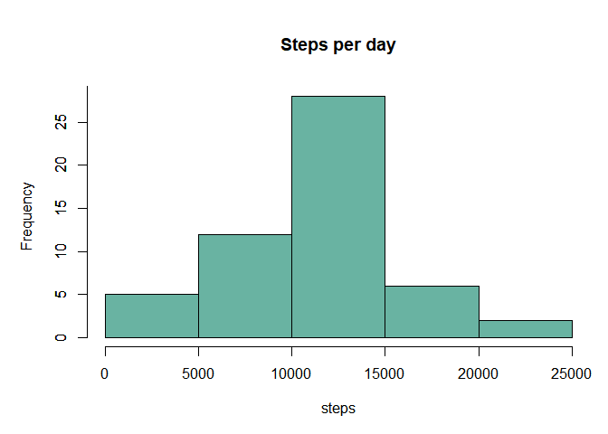
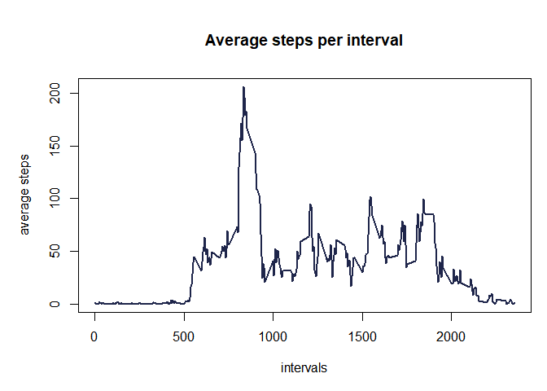
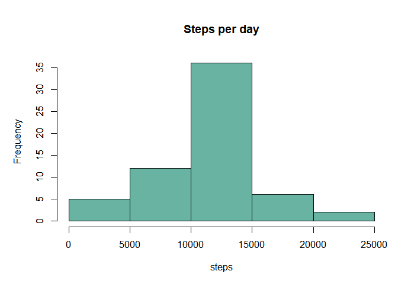
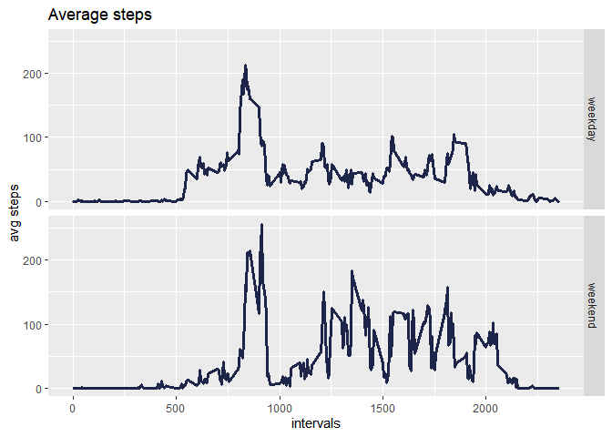

## Loading and preprocessing the data

The first thing to do is to load the libraries that we will need for data manipulation and graphs: in this case dplyr and ggplot2.  
We read the csv provided for this assignment through a read.csv, indicating also the presence of header and NA.
We then modify the "date" variable imported as a character in date.


```r
library(dplyr)
library(ggplot2)
dati = read.csv("activity.csv", header = TRUE, sep = ",", na.strings = "NA")
dati$date = as.Date(as.character(dati$date))
```

## What is mean total number of steps taken per day?

Through dpylr pipes we omit the NAs, group by date and calculate number of steps taken per day.


```r
steps.per.day = dati %>%
  na.omit() %>%
  group_by(date) %>%
  summarise(total = sum(steps))
```
  
We visualize what has just been calculated through a histogram that we call "Steps per day".


```r
par(mar = c(5,5,5,1))
hist(steps.per.day$total, col="#69b3a2", main = "Steps per day", xlab = "steps")
axis(2, at = seq(0,30,5), labels = seq(0,30,5))
```

<!-- -->

The mean and the median of steps taken per day follow:


```r
mean(steps.per.day$total)
```

```
## [1] 10766.19
```

```r
median(steps.per.day$total)
```

```
## [1] 10765
```

## What is the average daily activity pattern?

Always using dplyr, we omit the NAs as before, but this time we group by intervals.
We then calculate the average of the steps taken.

```r
steps.per.interval = dati %>%
  na.omit() %>%
  group_by(interval) %>%
  summarise(avg = mean(steps))
```
  
The time series plot "Average steps per interval" follows:

```r
par(mar = c(5,5,5,1))
plot(steps.per.interval, type = "l", lwd = 2, col="#1e254a",
     main = "Average steps per interval",xlab = "intervals", ylab = "average steps")
```

<!-- -->
  
We also want to know which is the interval containing the maximum number of steps.
We therefore select the top 1 entry (ordered by average calculated above).


```r
steps.per.interval %>%
  top_n(1, avg)
```

```
## # A tibble: 1 x 2
##   interval   avg
##      <int> <dbl>
## 1      835  206.
```

It's the interval 835 with an average of 206 steps.

## Imputing missing values

To see how many missing values are present in the database, we use the sapply function and adding any NA by column.


```r
sapply(dati, function(x) sum(is.na(x)))
```

```
##    steps     date interval 
##     2304        0        0
```

Therefore, there are missing values only for the "steps" variable.
We fill in all of the missing values with the average steps in that specific interval 
computed above, through the combo mutate and replace.  
We finally create a new data set "data.full".


```r
dati.full <- dati %>%
  mutate(steps = replace(steps, is.na(steps),steps.per.interval$avg))
```

Through dpylr pipes we group by date and calculate number of steps taken per day.
We visualize what has just been calculated through a histogram that we call "Steps per day".


```r
steps.per.day.full = dati.full %>%
  group_by(date) %>%
  summarise(total = sum(steps))
```

```
## `summarise()` ungrouping output (override with `.groups` argument)
```

We visualize it through a histogram that we call "Steps per day".


```r
par(mar = c(5,5,5,1))
hist(steps.per.day.full$total, col="#69b3a2", main = "Steps per day", xlab = "steps")
axis(2, at = seq(0,30,5), labels = seq(0,30,5))
```

<!-- -->

The mean and the median of steps taken per day follow:


```r
mean(steps.per.day.full$total)
```

```
## [1] 10766.19
```

```r
median(steps.per.day.full$total)
```

```
## [1] 10766.19
```

Using this technique we obtained at least the same average of the steps as above.

## Are there differences in activity patterns between weekdays and weekends?

We create a two-levels new variable "day" in the dataset
(Levels are namely “weekday” and “weekend”)


```r
week = dati.full %>%
  mutate(day = as.POSIXlt(date)$wday) %>%
  mutate(day = ifelse(day <= 5, "weekday", "weekend"))
```

We compute the average steps after grouping by interval and day


```r
avgsteps = week %>%
  group_by(interval,day) %>%
  summarise(avg = mean(steps))
```

```
## `summarise()` regrouping output by 'interval' (override with `.groups` argument)
```

We finally make a panel plot 

```r
ggplot(avgsteps,aes(interval,avg)) +
  geom_line(lwd = 1.1, colour="#1e254a") +
  facet_grid(rows = vars(day))+
  labs(x="intervals", y="avg steps") + 
  labs(title="Average steps")+
  theme(legend.position = "none")
```

<!-- -->
